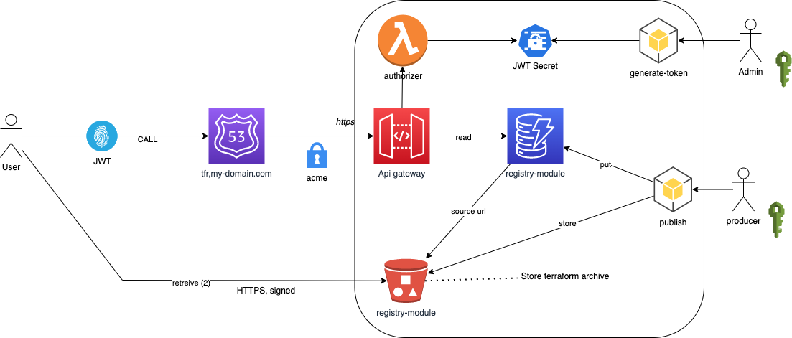

# Terraform Private Registry for AWS


This Terraform module establishes a private registry for Terraform, allowing
you to publish your own modules in a location you control independent of
Terraform's public registry at [`registry.terraform.io`](https://registry.terraform.io/).

Terraform module addresses can include
an optional hostname part which allows them to be downloaded from services
other than the public registry:

```hcl
module "awesomeapp" {
  source = "tf.example.com/awesomecorp/awesomeapp/aws"
}
```

This is a fork from https://github.com/apparentlymart/terraform-aws-tf-registry, created by Martin Atkins.

## Features :

- add JWT secret creation and sharing with secret manager
- add lambda autorizer for authentication
- automate API gateway redeployment
- add dedicated bucket storage
- add python script to deploy terraform module
- add control of dynamodb capacity (provisioned, pay per request, ...)
- add tags on resource
- add dynamodb capacity management and custom naming
- add bucket custom naming
- add storage output
- usage example
- automate API update after change


With this registy implemnentation, you can add a module source from "anywhere" like git, http server, and s3 bucket.

But for all this storage, you add to handle authentication (...).

> For my point of view, the more simple is to deploy zipped terraform module on a bucket (with ad hoc CI-CD pipeline) and handle access with aws s3 signature.
> That's why i added a dedicated bucket in this stack.

The registry return source module url like s3::https://s3....s/vpc.zip", when you use release command from  [this python client](https://github.com/geronimo-iia/terraform-aws-tf-registry-cli).

The s3:: prefix causes Terraform to use AWS-style authentication when accessing the given URL. 
No need to give public access to your bucket. [Read S3 Bucket](https://developer.hashicorp.com/terraform/language/modules/sources#s3-bucket)

> All management use case around this private terraform registry can be handled by [this python client](https://github.com/geronimo-iia/terraform-aws-tf-registry-cli)

Ths project has been battle tested in huge production workload since 2 years and cost less than 10$ per month.

## Terraform private registry design



Reference:

- [Authorizer](https://docs.aws.amazon.com/apigateway/latest/developerguide/apigateway-use-lambda-authorizer.html)
- [authorizer blueprint](https://raw.githubusercontent.com/awslabs/aws-apigateway-lambda-authorizer-blueprints/master/blueprints/python/api-gateway-authorizer-python.py)
- [registry](https://github.com/bikescholl/terraform-aws-tf-registry)
- [registry original](https://github.com/apparentlymart/terraform-aws-tf-registry)


### Implementation

You could have more specific information on [original registry implementation document here](./modules/registry-service/README.md).

Terraform's documented registry HTTP API is implemented via Amazon API Gateway relaying requests to a DynamoDB table that contains a simple index of modules.
The module packages themselves can be stored at any non-registry [module source address](https://www.terraform.io/docs/modules/sources.html) supported by Terraform, including in an S3 bucket with standard AWS authentication.


### Access Control

Terraform CLI supports bearer-token authentication credentials when making API requests. Credentials are configured on a per-hostname basis and apply to all services at that hostname.

Authorization is based on JWT token.

## Usage with terraform, terragrunt

### Configuration

Users must create `.terraformrc` file in their $HOME directory, with this content:

```hcl
credentials "registry.my-domain.com" {
    token = "Mytoken"
}
```

### Usage

```hcl
module "test" {
    source = "registry.my-domain/data/kinesis-firehose/aws"
    version = "0.2.0"
}
```

or

```hcl
module "test" {
    source = "registry.my-domain/data/kinesis-firehose/aws"
}
```

## Roadmap

- Add a Rest API to publish module with dedicated credentials
- Add an optional way to publish an event (with AWS Event Bridge) when a new release is published
- Add a way to mark a module as deprecated ?

## Notes

If you wanna use this project in production (like me...), I thinks that you should follow this tricks:

1. fork this project into your entrprise git server and add a remote branch 'github' to this repository
3. publish a dummy terraform module, see how it's managed in the dynamodb
4. integrate the python client into your ci


### few bash command line for testing


```bash
curl https://registry-my-domain.com/.well-known/terraform.json
> {"modules.v1":"/modules.v1/"}
```

```bash
curl https://registry-my-domain.com/modules.v1/
> {"message":"Missing Authentication Token"}
```

```bash
curl -H 'Accept: application/json' -H "Authorization: Bearer ${JWT_TOKEN}"  https://registry-my-domain.com/modules.v1/my-org/aws/kinesis-firehose/versions
```

```bash
>>
{
    "modules": [
        {
            "versions": [
                {"version": "0.4.4"}            ]
        }
    ]
}
```

```bash
curl -H 'Accept: application/json' -H "Authorization: Bearer ${JWT_TOKEN}"  https://registry-my-domain.com/modules.v1/my-org/aws/kinesis-firehose/0.4.4/download
```

```bash
>>
{
  "version": "{S=0.4.4}",
  "source": "{S=https:\/\/github..com\/my-org\/terraform-modules\/terraform-aws-kinesis-firehose.git?ref=v1.2.0}",
}
```

